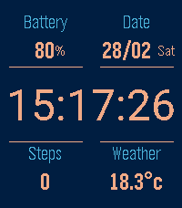

# Dashboard Pebble Watchface

## Screenshots

### Emery

## Credits

* Designer: SocketMix
* Programmer: justinjhendrick
* Inspired by: Samsung Galaxy Basic Dashboard

## Features

- [x] configurable colors for the text, clock, and numbers
- [x] Support 12hr and 24hr time
- [x] Support hrs:mins:seconds
- [x] Support hrs:mins
- [x] Temperature in Celcius or Fahrenheit
- [x] Support DD/MM and MM/DD for dates
- [x] Show Step Count
- [x] Roboto font for time
- [ ] Choose a better name
- [ ] More custom fonts (for date, temp, etc.)
- [ ] Support for smaller screens
- [ ] Support for round screens
